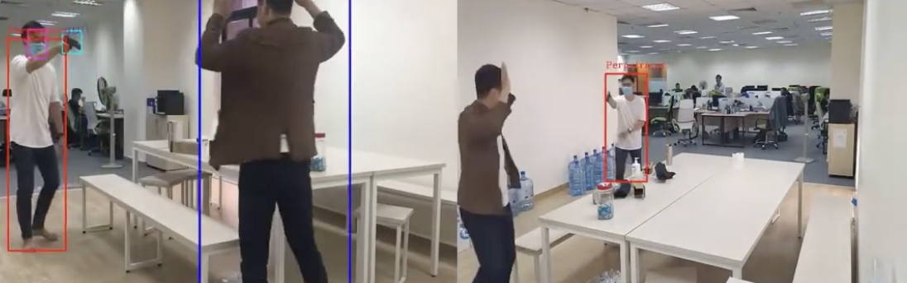
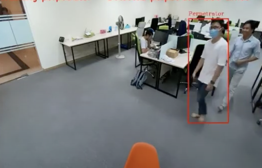
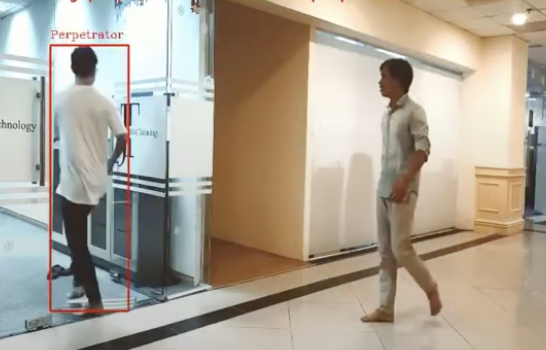

### Introduction

In this project, I developed a system for tracking multiple individuals across multiple camera views, both overlapping and non-overlapping. The aim was to create a reliable solution for real-time tracking of people, which could be applied in various scenarios like public safety and surveillance. This showcase highlights the key results and methods used, focusing on the overall outcomes and the system’s capability, rather than the specific implementation details.

### Tracking in Multiple Overlapping Views

This main component of the project focused on multi-person tracking across multiple overlapping camera views. In environments with multiple cameras covering the same region from different angles, the system was designed to identify and track individuals across these overlapping views. This was achieved primarily by a tailored appearance-based method based on person re-identification model in addition with data association techniques. For simplicity, I completely excluded people trajectory, motion and position prediction from this project. However, the combination of person re-ID features accross multiple views appeared to be simple yet robust against occlusion or discontinuity in occurrence. The only limitation was the generalization to different scenarios and conditions, as various similarity thresholds were empirically determined.



### Adaptation to Additional Non-Overlapping Views

The system then showed a well adaptability when extending to handle non-overlapping views, where additional cameras do not share a common field of vision. This still required a person to appear in at least two overlapping cameras at the beginning. As long as associated features were initialized in the database, the system no longer need overlapping cameras to track people.

### Practical Applications in Ongoing Criminal Actions and Loitering Detection

To illustrate practical applications, this tracking system was then utilized to detect crime in progress and loitering in public spaces:

#### Crime in Progress Detection 

The system can be integrated with object detection and human gesture models to detect criminal signals in real time, such as weapons, facial masks and surrender postures. As the result, the system can identify and follow perpetrators in different views.



#### Loitering Detection

The system monitors how long a person remains in a particular area. If an individual is observed to be loitering, especially in restricted or sensitive areas, an alert can be triggered for security personnel to investigate.

