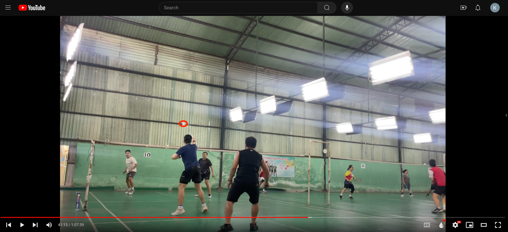
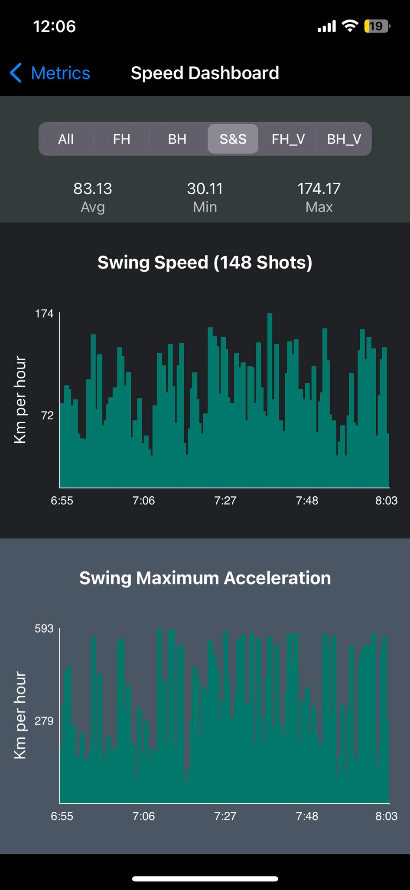
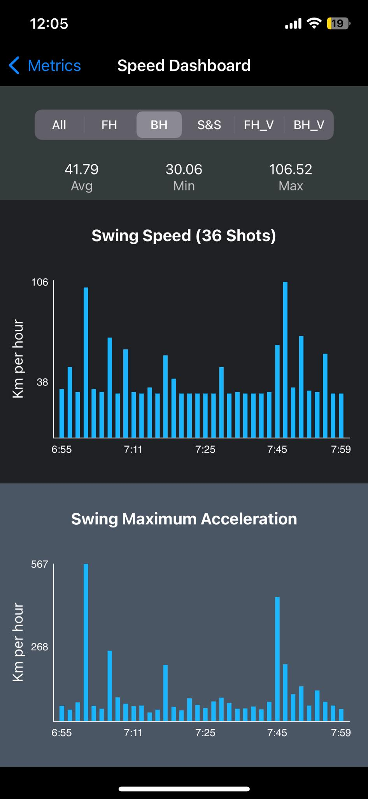

I could have chosen to learn badminton from a tutor, but I genuinely enjoy figuring things out by myself. Three years ago, I was a complete beginner in the sport, just like anyone starting something new.

I watched countless tutorials and self-taught the fundamentals. I focused on key aspects like basic swings, body mechanics to efficiently create a powerful-yet-natural movement using my wrist, arm, shoulder, and hips. I took a bottom-up approach, mastering one element at a time, and prioritizing consistency over speed.

The most crucial part of my self-learning journey was feedback. I started recording my sessions, analyzing my movements, and comparing them with pro players to ensure I was on track. Even after sustaining injuries—once with wrist arthritis and multiple times with ankle sprains—my focus on correcting posture and movement only grew stronger.

This journey led me to create this [YouTube channel](https://www.youtube.com/@phattruong6092), where I documented and shared my progress over the last three years (quite a few views, but I was not creating this for any fame-related purpose in the first place :grin: I usually put most of them in "Unlisted" so that only those who have the URLs can view). 

Moreover, I even discovered an app on the Apple Watch utilzing its built-in gyroscope and accelerometer sensor to detect tennis actions and measure swings metrics during a match. I immediately thought it could adapt to badminton because their nature are similar to some extend. However, the accuracy turned out to be average on badminton-specific actions.  Unstoppably, I attempted to retrieve the raw data from the Apple Watch to build my own ML model tailored to badminton, but I hit a roadblock as the data was partially censored for the level of analysis I needed and I had to stop.
 

Having said that, the process of recording and reviewing not only helped me improve, but also brought joy and lasting memories. It allowed me and my friends to analyze our games, discuss what made a point good or bad, and foster a positive learning environment where we could all improve together.

Today, I have to pause this hobby with my friends as I’m flying to another country to pursue my studies. Although I’m stepping away from badminton temporarily, this self-learning journey has reinforced how I approach other challenges in my life.

<!--more-->
